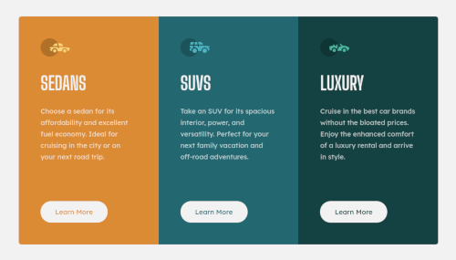

# Frontend Mentor - 3-column preview card component

This project is a Frontend Mentor challenge coded entirely for practising purpose. The challenge was to build three-column preview card component and to make the solution as close to the design as possible, with responsive layout to support mobile devices.

The goal was to implement the challenge entirely in VueJS v3 using latest TypeScript features, exploring JSX solutions and CSS modules. The project has also unit tests based on Jest framework.

## Technology

Technologies used to create the solution:

- VueJS v3 - https://v3.vuejs.org/ - Progressive framework responsible for view layer of websites
- VueCLI v5 - https://next.cli.vuejs.org/ - Command line tools to rapid develop Vue based projects
- Jest - https://jestjs.io/ - Fully featured unit testing framework

## Preview

Live preview is available on GitHub Pages, served from directory `docs/` directly:
 https://lethiandev.github.io/fm-three-column-cards

## References

Frontend Mentor challenge:
 https://www.frontendmentor.io/challenges/3column-preview-card-component-pH92eAR2-
